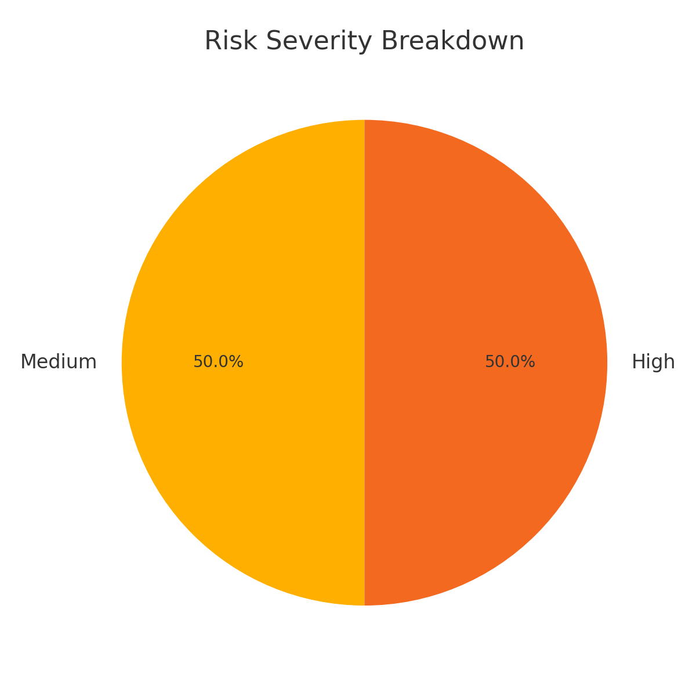

# ☁️ Cloud Migration Tracker + Risk Governance Dashboard

This project is a **real-world simulation** of a cloud migration portfolio tracker and risk analysis dashboard built in **Power BI**, powered by structured JSON data parsing and visual storytelling.

## 🔍 Project Overview

This dashboard helps organizations:

- Track cloud migration initiatives by **CAF domain**, **phase**, and **milestone**
- Visualize project **status and workload distribution**
- Parse and break down embedded **risk data** (from JSON blobs) into clear, actionable categories

## 📊 Key Visuals

- **CAF Domain Breakdown** – Projects by Cloud Adoption Framework domain
- **Milestone Progress Chart**
- **Risk Severity Breakdown** (pie chart)
- **Clean Project Summary Table**

### 🧠 Risk Severity Breakdown

  

## 🧠 AI/Cloud Skills Demonstrated

- Power BI dashboarding
- JSON data extraction & transformation
- Cloud migration scenario modeling
- Risk classification logic

## 📁 Dataset Fields

| Field         | Description                            |
|---------------|----------------------------------------|
| project_id    | Unique cloud project ID                |
| caf_domain    | Cloud Adoption Framework domain        |
| milestone     | Current milestone of the project       |
| phase         | Execution phase (Planning, Migration)  |
| risk_type     | Type of identified risk (parsed)       |
| risk_severity | Severity level (parsed)                |
| risk_owner    | Risk owner/contact (parsed)            |
| status        | Project status                         |
| workload      | Target app or system                   |

---

## ✅ Project Value

This tracker reflects the kind of cross-functional, governance-aware tooling used by **cloud project managers**, **engagement leads**, and **risk teams** when moving enterprise workloads to AWS or Azure.

---

## 🚀 Demo Use Case

Simulate this dashboard for:
- Executive updates
- Cloud PMO reviews
- Migration planning workshops
- Governance risk assessments

